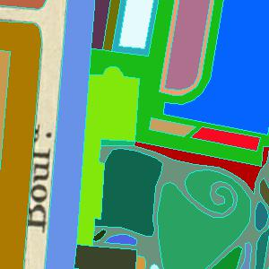
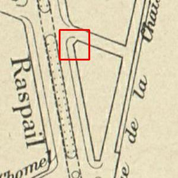
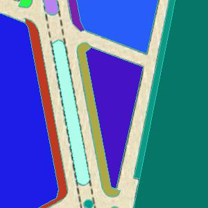
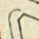
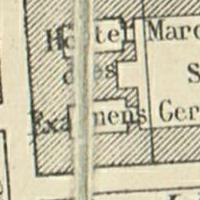
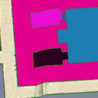

# Description of how we created historical map dataset

## Abstract

The historical maps contains large amount of spatial infromation in the ancient times.
We created two public dataset based on 'Atlas Municipal' and 'Verniquet' historical maps atlases for the following goals:

- Evaluating the performance of different segmentation algorithms.

- Evaluating the generalization ability of different segmentation algorithms for saving the annotations time of different maps.

## Tools

The tools we are using is QGIS which is a open-souce tools for wide-range of GIS applications.

## Criterions of annotating historical maps

**The road instances are removed from image for better visualiztion the objects, in reality, road instances are labelled as instances.**

We are planned for extracting the instances of objects in the maps with the highest granularity where every objects in the maps are seperated by lines or textures.

The objects are extracted manually from the maps should satisfy the flowing criterions:

- The boundaries of the objects should be closed (the boundaries could be lines or dash lines)

- Different objects can be seperated by different textures in the images

- Exceptions (Atlas Municipal): according to the applications, side walks are considered as closed objects, even the boundaries of objects are partially opened.

- Paper artifact: Image segmentation tools should be able to tolerance different levels of noise in the image such as pixel missing in the boundaries and paper artifcat which create gaps in the boundaries.

## Dataset stat

**Atlas Municipal**

| Dataset  | year   | Image_size |  shape  |
|----------|--------|:-----:|-------|
| Training      | 1926 | 4500, 9000 | 3342 |
| Validation    | 1926 | 3000, 9000 | 2182 |
| Testing       | 1898 | 6000, 5500 | 2835 | 

**Verniquet**

Relased soon...
